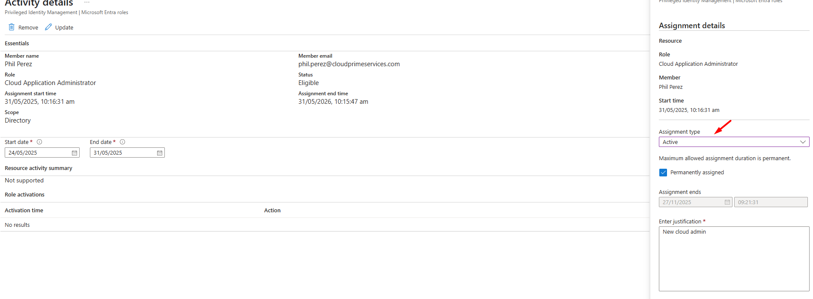
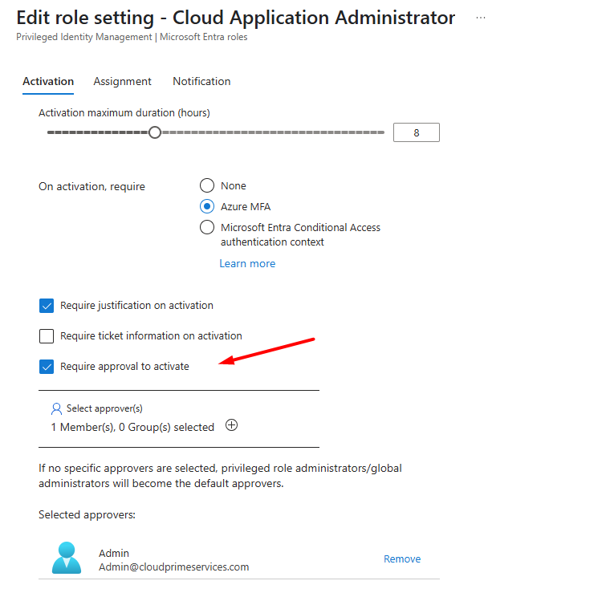

# Priviledged Identity Management (PIM) Setup

## Objective
This section walks you through enabling Azure AD Privileged Identity Management (PIM), assigning eligible roles, activating roles, and setting up approval workflows to manage privileged access securely.

---

## Prerequisites

- Azure AD Premium P2 License
- Access to the Azure Portal
- You mibe be a Global Administrator or priviledged Role Administrator to configure PIM

---

## Step 1: Enable PIM

1.	Go to the Azure Portal.
2.	Search for and select Azure AD Privileged Identity Management.
3.	Under Manage, click Azure AD roles.
4.	If prompted to consent or onboard PIM, click Consent or Begin onboarding.

---

## Step 2: Assign an ELigible Role

1.	In the PIM blade, click Azure AD roles > Roles.
2.	Select a role (e.g., Global Administrator).
3.	Click + Add assignments.
4.	Choose Eligible, select the user, and specify a start and end time if needed.
Click Assign.

---

## Step 3: Activate a Role

1.	Still in PIM, go to My roles.
2.	Click the role you want to activate.
3.	Click Activate.
4.	Optionally provide a reason and MFA confirmation.
5.	Click Activate again.

---

## Step 4: Require Approval for Role Activiation

1.	Navigate to Azure AD roles > Settings.
2.	Select a role (e.g., Global Administrator).
3.	Under Activation settings, turn on Require approval to activate.
4.	Choose approvers.
5.	Set duration and other settings.
6.	Click Update.

---
