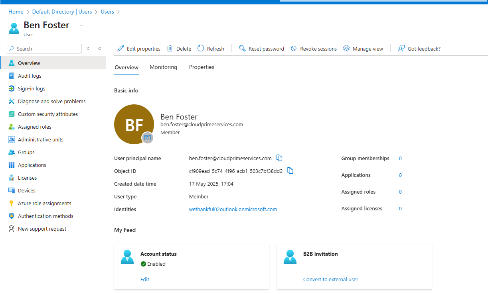
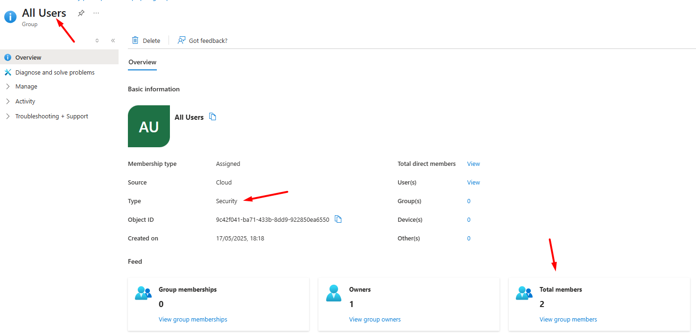

# User and Group Management

## Objective
This section covers how to create and manage users and groups in Azure Active Directory (Entra ID) to control access and permissions.

---

## Prerequisites

- Azure AD Administrator or equivalent permissions.
- Access to the Azure Portal or Azure CLI/PowerShell.
- AzureAD or Microsoft.Graph PowerShell modules installed (depending on version used).

---

## Step 1: Create a New User in Azure Portal

1. Sign in to the [Azure Portal](https://portal.azure.com).
2. Navigate to **Azure Active Directory** > **Users**.
3. Click **+ New user**.
4. Fill in the required fields like **Name**, **Username**, and optionally assign roles.
5. Click **Create**.



---

## Step 2: Create a New User Using PowerShell

```powershell
# Connect to Azure AD
Connect-AzureAD

# Create a new user with password profile
New-AzureADUser -DisplayName "John Doe" `
                -UserPrincipalName "john.doe@example.com" `
                -AccountEnabled $true `
                -PasswordProfile @{ Password = "P@ssword123"; ForceChangePasswordNextLogin = $true } `
                -MailNickname "johndoe"


```

---

## Step 3: Create a New Group in Azure Portal

1. In the [Azure Portal](https://portal.azure.com), navigate to **Azure Active Directory** > **Groups**.
2. Click **+ New group**.
3. Select the **Group type** (Security or Microsoft 365).
4. Provide a **Group name** and optional **Description**.
5. Optionally assign an owner and members.
6. Click **Create**.



---

## Step 4: Add Users to a Group Using PowerShell

```powershell
# Connect to Azure AD
Connect-AzureAD

# Add a user to a group
Add-AzureADGroupMember -ObjectId <GroupObjectId> -RefObjectId <UserObjectId>
```

> 🔎 **Tip**: Use `Get-AzureADUser` and `Get-AzureADGroup` to retrieve the required Object IDs.

---

## Next Steps

- Assign licenses via group membership.
- Explore dynamic group membership rules.
- Review audit logs for user and group activities.
